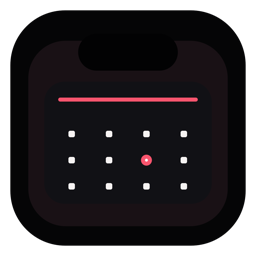
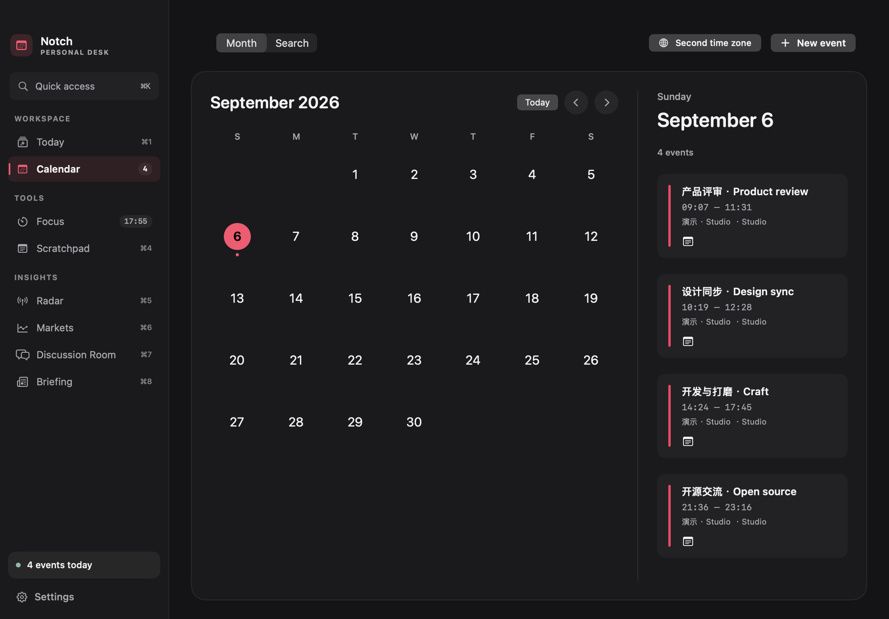

<p align="center">
  
</p>

# Notch Calendar

**Your calendar, meetings, notes, and focus time — one native Mac workspace.**

[简体中文](README.md) · **English** · [Download](https://github.com/GpsLypy/NotchCalendar/releases/latest) · [Changelog](CHANGELOG.md) · [Report an issue](https://github.com/GpsLypy/NotchCalendar/issues)

macOS 15+ · Apple Silicon & Intel · SwiftUI · Currently free · MIT



The workspace above and the [visual feature tour](README.md#界面与功能) use native app views. Calendar, note, and focus records are demo fixtures. Screenshots show Simplified Chinese; the app also supports English and system language. See [image sources](docs/images/README.md).

## Install and get started

1. Download the DMG from [Releases](https://github.com/GpsLypy/NotchCalendar/releases/latest), open it, and drag **Notch Calendar** into **Applications**.
2. Launch the app and allow Calendar access. Choose the calendars you want to display in Settings.
3. Hover intentionally over the notch or click it to see your agenda. Click the Dock icon to open the full workspace. A click-only mode is available; non-notched displays use a top-centre surface.
4. Enable meeting reminders and the global join shortcut in Settings if you need them. Reminders follow macOS notification and Focus settings.

Published builds are currently ad-hoc signed and not Developer ID notarized. Automatic app replacement is disabled. When upgrading from 0.7.0 or 0.8.0, open the downloaded DMG in Finder and quit the old app before replacing it; 0.8.1 fixes the older “Open DMG & Quit” crash.

## Version 1.1

A consistent graphite palette, clearer text hierarchy and restrained accents bring the workspace together. The desktop month calendar has its own responsive layout, giving the month and selected day's agenda room to breathe. The day track, meeting notes and Command-K quick access remain available.

Cold launch keeps the calendar collapsed. Opening the workspace starts on Calendar. Saved focus tasks, time and history are preserved; starting or resuming focus explicitly makes it a notch activity. A previously running session continues in the background.

[Download 1.2.0](https://github.com/GpsLypy/NotchCalendar/releases/tag/v1.2.0) · [Release and validation notes](docs/quality/RELEASE_1.2.0.md). This manual-install build uses ad-hoc signing only, without Developer ID signing or notarization. Final performance and some hardware acceptance remain pending; see the [quality report](docs/quality/README.md).

## Features

- Compact notch view that stays still when idle; live meeting shoulders are available as an opt-in setting.
- Expanded agenda and month calendar after an intentional hover, with a click-only mode when you want the notch to remain completely quiet.
- A graphite desktop workspace with a persistent sidebar, Today overview, responsive calendar, focus timer, scratchpad, and Radar.
- Radar shows ten Hot, Ask, or Show Hacker News signals, then stops. It refreshes only when opened, keeps a 30-minute local cache, and preserves saved results when the network is unavailable.
- Markets (`⌘6`) keeps up to eight US stock or ETF symbols, with add/remove/reorder controls, manual closing-quote refresh, trade dates, per-symbol errors, and a 15-minute cache. Add your own Alpha Vantage key in the page; it stays in macOS Keychain. This is a personal, end-of-day observation tool, not a real-time trading feed. See [provider setup and limits](docs/markets-provider.md).
- Discussion Room (`⌘7`) opens real Hacker News topics and a bounded set of attributed comments. Keep your stance, private notes and saved threads locally, with original-source links and offline retention. The page explicitly represents a limited community sample.
- Briefing (`⌘8`) collects up to twenty current headlines from GitHub Blog, Swift.org and NASA. Filter by source or keyword, mark items read, and save up to one hundred articles locally. The 30-minute cache survives network errors; [source details](docs/briefing-sources.md) explain the scope.
- Three matching desktop widgets for the month calendar, live focus progress, and today's agenda. Each has a small, explicit open control instead of turning the whole widget into a launch target. Control-click the desktop, choose **Edit Widgets**, then search for **Notch Calendar**.
- Cold launches initialize the collapsed calendar without raising the desktop window or automatically displaying a saved focus session. Starting or resuming focus makes it the current notch activity; enabled meetings keep their existing priority. Clicking the Dock icon opens or restores the full workspace.
- Drift-resistant 5, 25, and 50 minute timers that keep their place while you switch tools or the Mac sleeps.
- Calendar source selection in Settings applies consistently to Today, the notch, the month view, and widgets. Hidden calendars stay hidden after relaunch; new calendars appear automatically, and an empty selection never falls back to showing everything.
- Today's planning card finds remaining openings within configurable local hours and meeting buffers, flags overlapping timed events, and prepares up to 50 minutes of focus for the current opening. Free, canceled, declined, and all-day events do not block openings; all-day events remain in the agenda. Suggestions never start automatically or replace an unfinished timer.
- Custom 5–180 minute focus sessions, separate break tracking, today's and this week's completed focus minutes, and a local journal of the latest 1,000 completions with CSV export. Totals use the session's completion date; legacy cumulative counts remain without invented history.
- A local scratchpad with automatic saving, timestamps, and one-click copy.
- Opt-in meeting notifications with 5/10-minute snooze and occurrence dismissal, plus a configurable global join shortcut (default Control–Option–J). Hidden, canceled and declined meetings are excluded. Delivery follows macOS notification/Focus settings; keep the app running to follow calendar changes.
- Search selected calendars by title, location or source within a configurable range of up to 366 days. Create timed/all-day events in a writable system calendar with daily, weekly or monthly recurrence; matching cross-calendar duplicates can be combined for display without changing the originals. View a second time zone alongside each event.
- Meeting notes stay attached to individual occurrences, support local search and Markdown export, and preserve Chinese input composition. Export/restore local notes and supported settings through a validated JSON backup, review contents before replacing them, and undo the last restore.
- Four native Apple Shortcuts actions: Open Today, Start Focus (5–180 minutes plus optional task label), Append to Scratchpad, and Join Next Meeting. App Intents metadata is generated and checked in the packaged app.
- Task labels in focus history, daily totals and task breakdowns for previous/current weeks, and Markdown weekly-review export. CSV exports include the task label and protect spreadsheet cells from formula interpretation.
- In-app language selection for Simplified Chinese, English, or the current system language, applied without restarting.
- One-click Smart Join for Zoom, Google Meet, Microsoft Teams, Webex, Around, and Whereby, plus an Open link action for other structured event URLs.
- Previous and next month navigation with locale-aware weekday ordering.
- Calendar access via EventKit; calendar-account sync follows macOS settings. Notes and focus history stay local, and the app has no account service of its own.
- Automatic update checks at launch, a manual refresh action, structured release notes in Settings, and a green sidebar update shortcut whenever a newer GitHub Release is available.

Smart Join resolves the event’s structured URL first, then looks for known conferencing domains in its location and notes. Link detection happens locally, and ordinary links in free-form text are ignored to reduce accidental opens.

## Keyboard and automation

| Action | Shortcut |
| --- | --- |
| Today / Calendar / Focus / Scratchpad | `⌘1` / `⌘2` / `⌘3` / `⌘4` |
| Radar / Markets / Discussion / Briefing | `⌘5` / `⌘6` / `⌘7` / `⌘8` |
| Join the current or next eligible meeting from another app | `⌃⌥J` by default; enable and configure in Settings |

The numbered shortcuts work in the workspace. Install and launch the app once, then search for **Notch Calendar** in Apple Shortcuts to find Open Today, Start Focus, Append Note, and Join Meeting.

## Run from source

Open the folder in Xcode and run the `NotchCalendar` executable scheme, or run:

```sh
swift run NotchCalendar
```

Run deterministic checks with `swift test` using full Xcode (when Command Line Tools are selected, use `DEVELOPER_DIR=/Applications/Xcode.app/Contents/Developer swift test`). The optional `MarketingCaptureTests` live-source/native-rendering check is skipped unless `NOTCH_CAPTURE_PATH` names an output directory.

On first launch, allow Calendar access in the system prompt. The app falls back to the top-centre position on displays without a camera housing.

## Publish on GitHub

1. Create a GitHub repository and push this project to it.
2. If you fork the project, replace `GpsLypy/NotchCalendar` in `Support/Info.plist` with the fork’s `owner/name` value.
3. Create and push a version tag, for example `v0.1.3`.

The included GitHub Actions workflow creates both a macOS DMG installer and ZIP archive, then publishes them as a GitHub Release with curated Added, Improved, and Fixed notes from `CHANGELOG.md`. It can be triggered by pushing a version tag or manually from the **Actions** tab. The app checks that release feed automatically at launch, can also refresh it from Settings, displays the release’s structured update notes, selects the exact versioned DMG, and verifies GitHub’s published SHA-256 digest. When an update is available, a green circular-arrow shortcut appears above Settings in the sidebar. The DMG includes an Applications shortcut for standard drag-to-install behavior.

Release packages are built as universal2 binaries for both Apple Silicon and Intel Macs. The workflow mounts the final DMG and verifies both architectures, nested code signatures, app/widget version alignment, and the Applications shortcut before publishing.

Stable releases also validate their own quality record. Any owner-authorized publication with pending acceptance must match that version's recorded request, final runtime fingerprint and exact remaining checks. The exception cannot waive a measured failure or carry over from an older release. Use `python3 Scripts/quality/verify_release_gate.py 1.2.0 --strict` to inspect every outstanding gate regardless of a publication decision.

Automatic app replacement is currently disabled; the project retains the signed-helper and validation foundation for a future crash-recoverable installer. The update screen uses the manual path instead: **Open DMG & Quit** closes the running version before you drag the replacement into Applications. For Developer ID-signed builds, Settings can also verify and open an equal or newer Applications copy when the app is running from a mounted disk image.

Without a Developer ID certificate, packaging requires the explicit `ALLOW_ADHOC_RELEASE=1` opt-in and produces ad-hoc signed archives without notarization. For Developer ID distribution, set `DEVELOPER_ID_APPLICATION` to a valid Apple Developer ID Application certificate and `NOTARYTOOL_PROFILE` to a configured `notarytool` keychain profile before running the release script. This allows the script to enable hardened runtime, notarize the app, and staple the result before packaging it.

See [the product roadmap](docs/PRODUCT_ROADMAP.md) for the stability requirements and planned market, weather, and local-assistant integrations.

The calendar, meeting, notes and focus workflow has no payment or account requirement. Earlier implementation references remain available in [workflow setup and limits](docs/WORKFLOWS_V0.8.0.md), [0.8 validation details](docs/VALIDATION_V0.8.0.md), and [the product review](docs/PRODUCT_REVIEW_2026-09-05.md).

## Buy me a coffee / 请作者喝杯咖啡

If Notch Calendar makes your day a little easier, you can support its continued development with a coffee. Thank you for every bit of encouragement.

如果 Notch Calendar 让你的一天轻松了一点，欢迎请作者喝杯咖啡，感谢每一份支持与鼓励。

<p align="center">
  
</p>

## License

Released under the [MIT License](LICENSE).
