<p align="center">
  
</p>

# Notch Calendar

**把日程放在 Mac 刘海旁，把会议、笔记和专注安排在一起。**

一个原生 macOS 个人工作台：抬眼查看下一场会议，需要时展开完整日历，随手记下结论，再为手头的任务留出一段专注时间。

**简体中文** · [English](README.en.md) · [下载最新版](https://github.com/GpsLypy/NotchCalendar/releases/latest) · [更新日志](CHANGELOG.md) · [反馈问题](https://github.com/GpsLypy/NotchCalendar/issues)

macOS 15+ · Apple 芯片与 Intel · SwiftUI 原生界面 · 当前免费 · MIT 开源

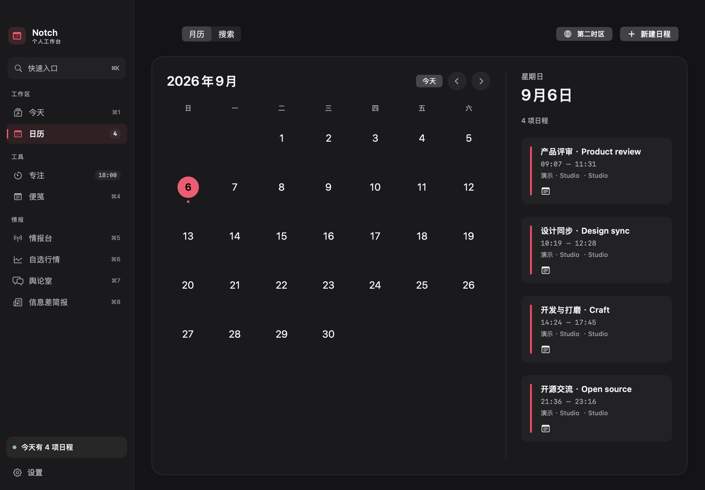

*原生应用界面，日程、笔记和专注记录使用演示数据。应用支持简体中文、English 和跟随系统；[查看配图来源](docs/images/README.md)。*

[界面与功能](#界面与功能) · [开始使用](#开始使用) · [快捷键与自动化](#快捷键与自动化) · [数据与权限](#数据与权限) · [开发与贡献](#开发与贡献)

## 能帮你做什么

| 你的场景 | 在 Notch Calendar 中 |
| --- | --- |
| 手头忙着，想知道下一场会议什么时候开始 | 从刘海查看日程与会议入口，按需开启会前提醒 |
| 日程分散在多个日历里 | 选择日历来源，搜索日程，合并显示完全重复项 |
| 想安排周期会议，还要考虑异地同事的时间 | 创建日程，设置每日／每周／每月重复，并查看第二时区 |
| 开完会找不到上次的结论 | 给每一场会议单独记笔记，搜索记录并导出 Markdown |
| 会议之间想做点完整的工作 | 查看今日空档，准备专注计时，用任务标签整理周回顾 |
| 想看点资讯，又不想一直刷下去 | 看有限条数的情报、讨论和简报，保留值得回看的内容 |

## 界面与功能

### 1.1：日历回到中心

工作台改为统一的**石墨灰色调**，配合清晰的文字层级与克制的强调色。独立的桌面月历随窗口调整布局，让月份与所选日期的安排都有合适的空间。今日时间轨道、会议笔记与 `⌘K` 快速入口继续保留。

启动时保持**日历收缩态**；主动打开工作台默认进入日历。上次暂停的专注时长、任务与历史仍在，点击开始或恢复后才成为刘海活动；原来仍在运行的会话继续在后台计时。

[下载 1.2.1](https://github.com/GpsLypy/NotchCalendar/releases/tag/v1.2.1) · [本版变化与验证](docs/quality/RELEASE_1.2.1.md)。

本版仅使用 ad-hoc 签名，手动安装。最终性能与部分实机验收仍待完成，具体范围见[质量报告](docs/quality/README.md)。

### 刘海日历与会议助手

平时保持紧凑，停稳悬停或点击后展开日程；也可以切换为仅点击打开。完整桌面工作台提供今日总览、月历和工具侧栏，无刘海的显示器也能使用顶部居中入口。

| 展开的刘海日历 | 下一场会议 |
| --- | --- |
| 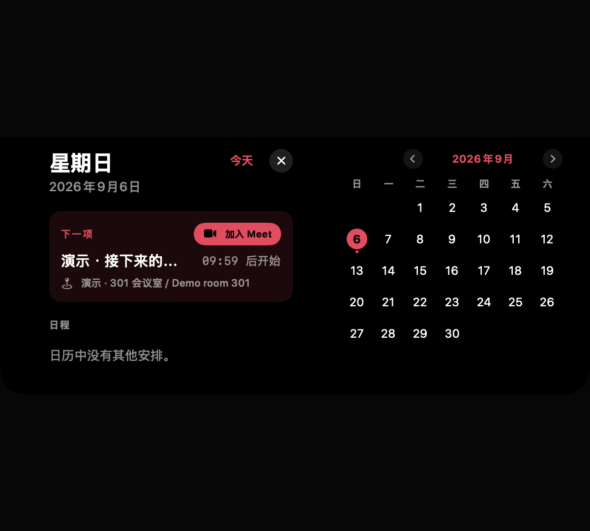 | 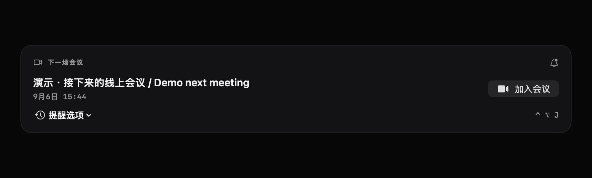 |

- **会前提醒**：按需开启；支持延后 5 / 10 分钟、忽略本次，日历变化和唤醒后重新校正。
- **快捷入会**：识别 Zoom、Google Meet、Teams、Webex、Around 和 Whereby；支持事件中的其他结构化网址。
- **全局入会**：默认 `⌃⌥J`，需在设置中启用，可自定义；适用于进行中或 15 分钟内开始的有效会议。

图中刘海日历展示的是展开内容组件，不包含实体摄像头或桌面背景。提醒投递受 macOS 通知和专注模式影响，应用运行时才能持续跟进日历修改。

### 查找、创建和跨时区查看日程

把“这场会在哪一天”和“对方那里几点”放在同一个日历页面处理。

| 日程搜索与第二时区 | 快速创建周期日程 |
| --- | --- |
| 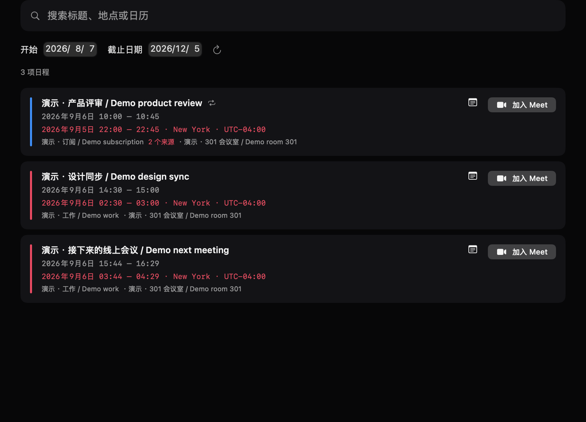 | 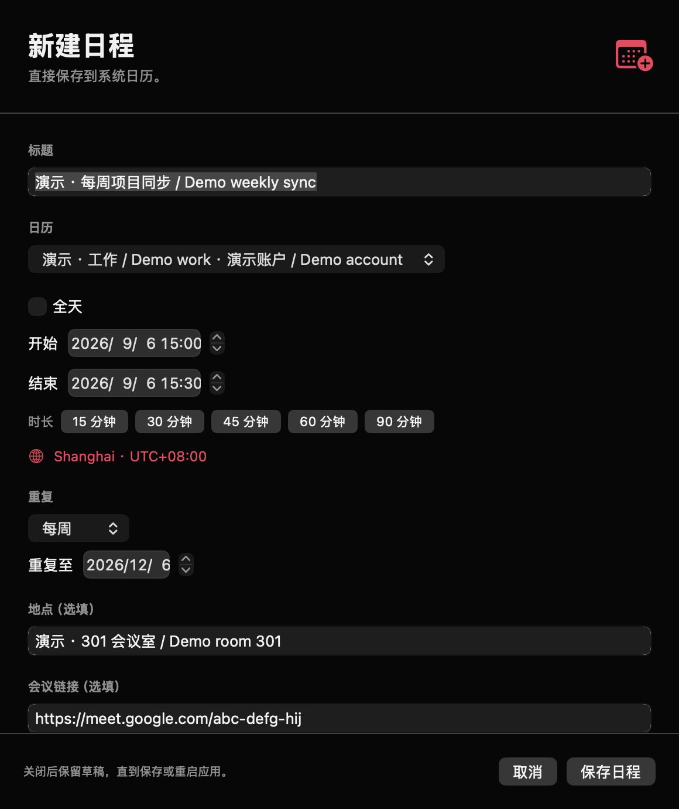 |

- 按标题、地点、日历名称搜索；日期范围最多 366 天，最多展示 200 个匹配并提示截断。
- 在可写的系统日历中创建定时或全天日程，支持每日、每周、每月重复及截止日期。
- 第二时区显示对应日期、时间和 UTC 偏移，处理跨日与夏令时。
- 完全相同的跨日历事件可合并显示，原始事件不被删除；已有日程的编辑、删除仍通过系统日历完成。

### 便笺、会议笔记与备份恢复

随手记录和会议结论各有入口。每一次周期会议都可以保留独立笔记，回看时不用在一大段便笺里翻找。

| 关联到具体场次的会议笔记 | 恢复前核对 |
| --- | --- |
| 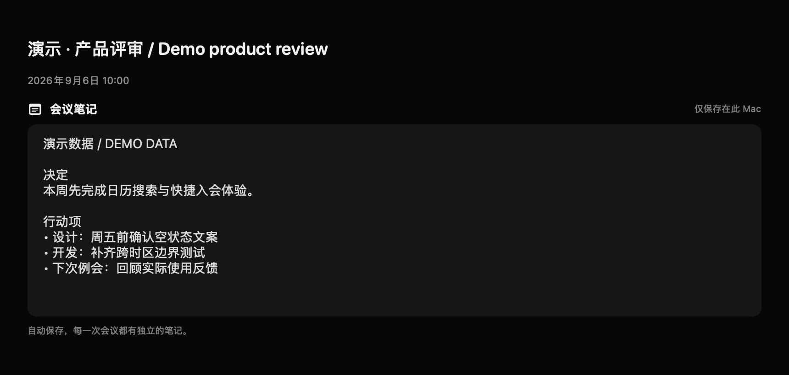 | 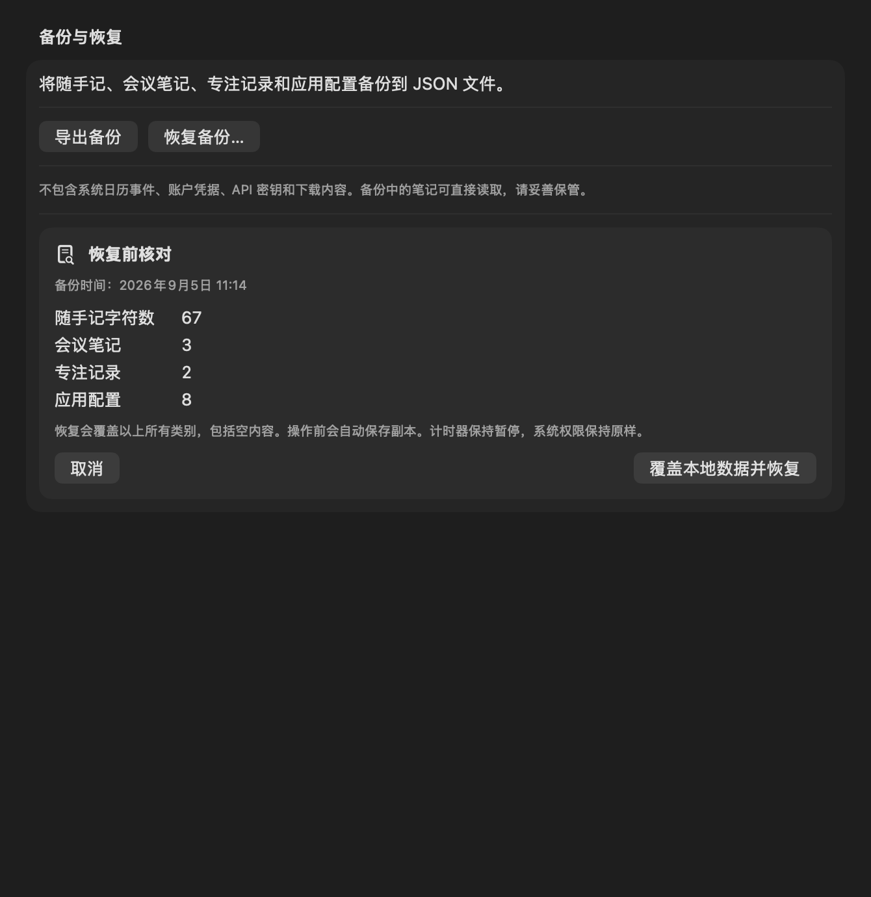 |

- 普通便笺自动保存、一键复制；会议笔记支持本地搜索和 Markdown 导出。
- JSON 备份包含便笺、会议笔记、专注历史及支持的配置。
- 恢复前校验文件并展示内容，确认后覆盖；自动保存恢复前的副本，可撤销上次恢复。
- 备份不包含系统日历事件、账户密钥或系统权限；笔记以明文导出，由你选择保存位置。

### 专注计时与周回顾

从今日空档准备一段专注，给任务加上标签，周末再看时间实际花在了哪里。

| 自定义专注时长与任务标签 | 按天、按任务查看完成记录 |
| --- | --- |
| 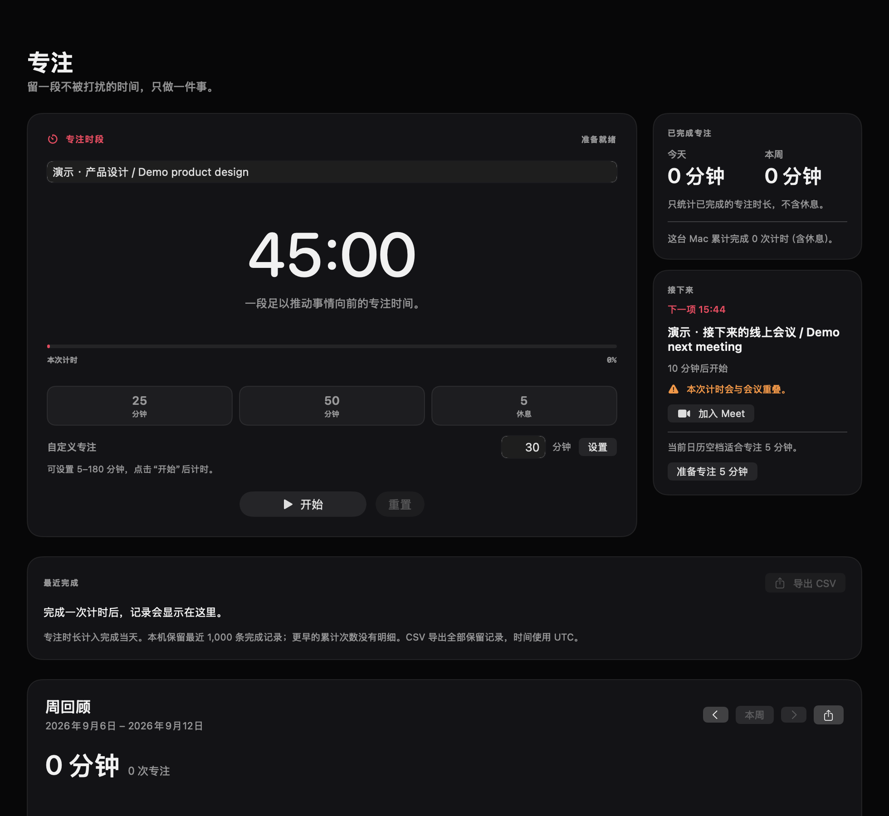 | 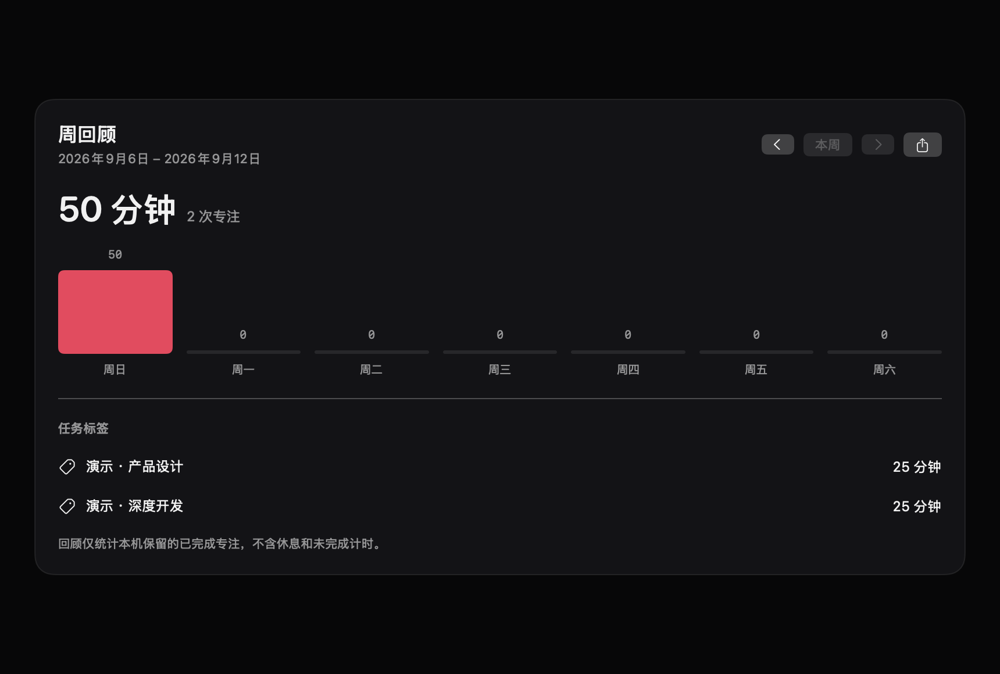 |

- 支持 5–180 分钟自定义专注、独立休息计时，暂停后保留进度。
- 今日规划结合工作时段和会议缓冲，提示空档与冲突；准备计时后由你点击开始。
- 查看本周及过去周的每日完成分钟和任务汇总，导出 Markdown 周回顾或 CSV 历史。
- 保留最近 1,000 次完成记录；周回顾只统计已完成专注，不计入休息或未完成计时。

### 有限的信息浏览

每个页面都有明确的条数上限和原文入口。感兴趣的内容可以留下，网络暂时不可用时仍能回看已有缓存。

| 情报台 Radar | 信息差简报 |
| --- | --- |
| 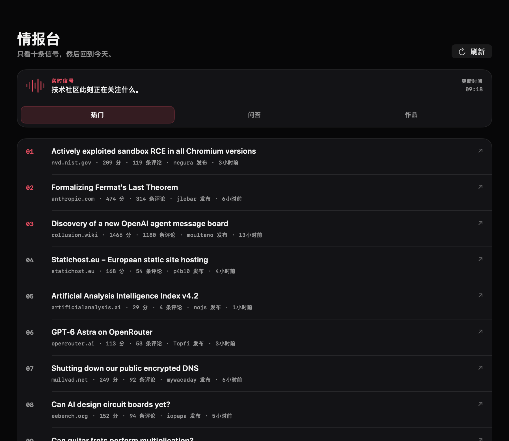 | 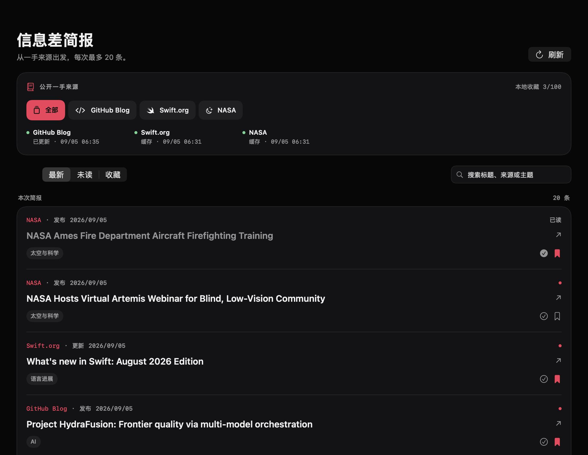 |

- **情报台**：每次十条 Hacker News Hot / Ask / Show，提供原文和本地留存。
- **信息差简报**：汇集 GitHub Blog、Swift.org、NASA，每次最多 20 条，支持来源／关键词筛选、已读与收藏。

| 行情观察台 | 舆论室 |
| --- | --- |
| 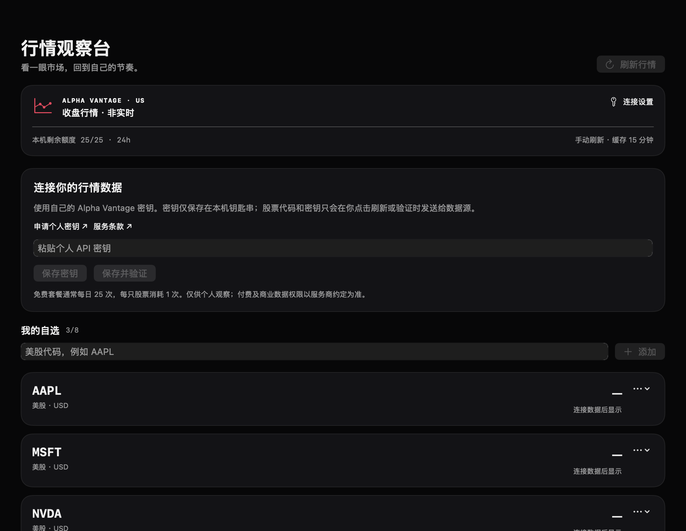 | 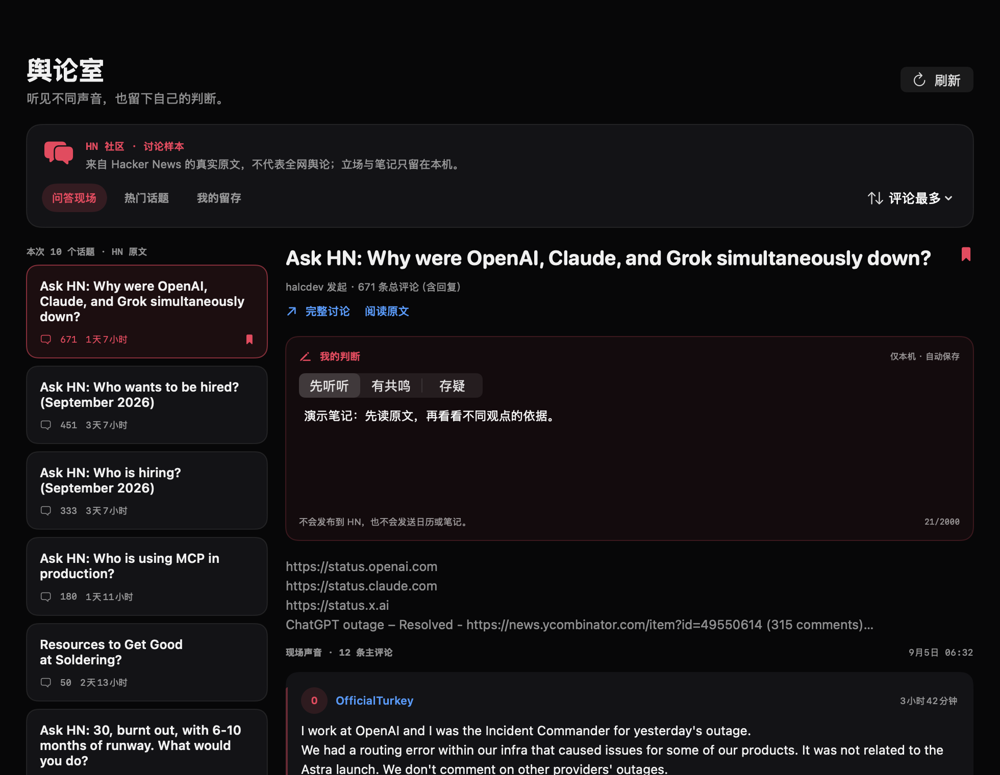 |

- **行情观察台**：最多八个美股／ETF 自选，手动刷新收盘行情；使用自己的 Alpha Vantage 密钥，保存在 macOS 钥匙串中。提供的是收盘观察数据，不是实时交易行情。
- **舆论室**：阅读 Hacker News 话题及有限数量的署名评论，保存立场、私人笔记和话题；笔记不会发布到 HN。

以上资讯图片为历史公开内容画面，标题、热度、时间不代表实时状态。行情图展示未连接状态。详见[行情数据源](docs/markets-provider.md)与[简报来源](docs/briefing-sources.md)。

### 桌面小组件

提供 **月历、专注进度、今日日程** 三种 WidgetKit 小组件。右键桌面 →「编辑小组件」→ 搜索 **Notch Calendar** 添加；组件中的打开按钮可跳转到应用对应页面。

小组件使用主应用生成的本地快照，首次使用请先打开应用并授予日历权限。

## 开始使用

1. 在 [GitHub Releases](https://github.com/GpsLypy/NotchCalendar/releases/latest) 下载 DMG，打开后将 **Notch Calendar** 拖入「应用程序」。
2. 首次打开时允许日历访问，在设置中选择要显示的日历来源。
3. 将鼠标停在刘海附近或点击顶部入口查看日程；点击 Dock 图标打开完整工作台。
4. 按需开启会议提醒、全局入会快捷键，并选择简体中文、English 或跟随系统。

**系统要求：**macOS 15 及以上，Apple 芯片或 Intel。当前无需注册 Notch Calendar 账户、没有付费墙；行情服务需另行配置个人数据源密钥。

当前公开构建采用 ad-hoc 签名，尚未进行 Developer ID 公证，更新使用手动替换。若从 0.7.0 / 0.8.0 升级，请在访达中打开下载的 DMG，再退出旧版并替换应用；0.8.1 已修复旧版「打开 DMG 并退出」的崩溃。

## 快捷键与自动化

| 入口 | 快捷键 |
| --- | --- |
| 快速入口 | `⌘K` |
| 今日 / 日历 | `⌘1` / `⌘2` |
| 专注 / 便笺 | `⌘3` / `⌘4` |
| 情报台 / 行情观察台 | `⌘5` / `⌘6` |
| 舆论室 / 信息差简报 | `⌘7` / `⌘8` |
| 从其他应用加入有效会议 | 默认 `⌃⌥J`，需在设置中启用，可修改 |

数字快捷键用于应用工作台内导航。将应用放入「应用程序」并至少打开一次后，可以在系统「快捷指令」操作库搜索 **Notch Calendar**：

| 快捷指令操作 | 用途 |
| --- | --- |
| Open Today · 打开今日 | 打开今日日程与规划 |
| Start Focus · 开始专注 | 传入 5–180 分钟与可选任务标签，保留已有未完成计时 |
| Append Note · 追加便笺 | 将文字追加到最新便笺末尾 |
| Join Meeting · 加入会议 | 使用与应用内一致的会议选择规则 |

详细设置、提醒范围、周期事件处理和备份边界见[功能使用说明](docs/WORKFLOWS_V0.8.0.md)。

## 数据与权限

| 数据或能力 | 如何处理 |
| --- | --- |
| 日历 | 通过 EventKit 访问系统日历；账户同步由 macOS 的日历账户设置决定 |
| 便笺、会议笔记、专注历史 | 保存在本机；由你主动导出或备份，无自建账户同步 |
| 通知与全局入会 | 按需开启；通知需系统授权，全局入会快捷键无需辅助功能权限 |
| 行情密钥 | 存放在 macOS 钥匙串，刷新或验证时用于请求数据源 |
| 公开资讯与更新 | 请求相应公开来源和 GitHub Releases；断网时保留已有资讯缓存 |

本地记录与外部资讯使用不同的数据流程。备份文件不等同于云端同步，也不会替你增删系统日历事件。

## 开发与贡献

使用完整 Xcode 与 Swift 6 工具链。可以在 Xcode 中打开项目文件夹并运行 `NotchCalendar`，或在仓库根目录执行：

```sh
swift run NotchCalendar
swift test
```

若当前选择的是 Command Line Tools，可为命令指定完整 Xcode：

```sh
DEVELOPER_DIR=/Applications/Xcode.app/Contents/Developer swift test
```

截图导出和真实订阅源联网检查需显式开启，默认测试会跳过这些按需项目。[英文文档](README.en.md#publish-on-github)包含打包、签名和发布说明；[配图说明](docs/images/README.md)记录截图来源与重新生成方式。

欢迎通过 [Issues](https://github.com/GpsLypy/NotchCalendar/issues) 提交问题或功能建议。报告问题时请附应用版本、macOS 版本、复现步骤；分享日志或截图前请移除私人日程和笔记。

- [更新日志](CHANGELOG.md)
- [功能使用说明](docs/WORKFLOWS_V0.8.0.md)
- [验证范围](docs/VALIDATION_V0.8.0.md)
- [产品路线图](docs/PRODUCT_ROADMAP.md)

## 支持项目

如果 Notch Calendar 让你的一天轻松了一点，欢迎请作者喝杯咖啡。

<details>
<summary>微信赞赏</summary>

<p align="center">
  
</p>

</details>

## 许可证

采用 [MIT License](LICENSE)。
