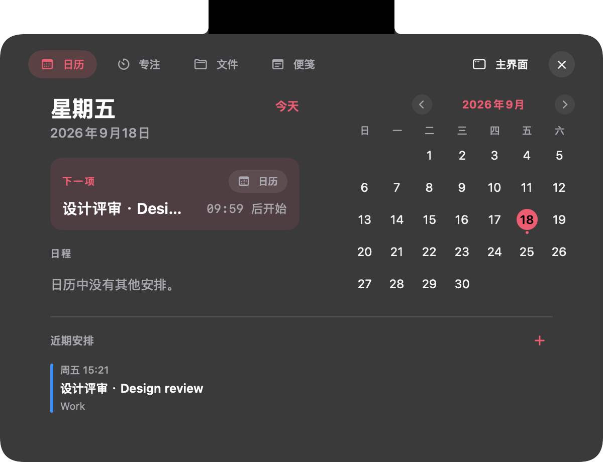
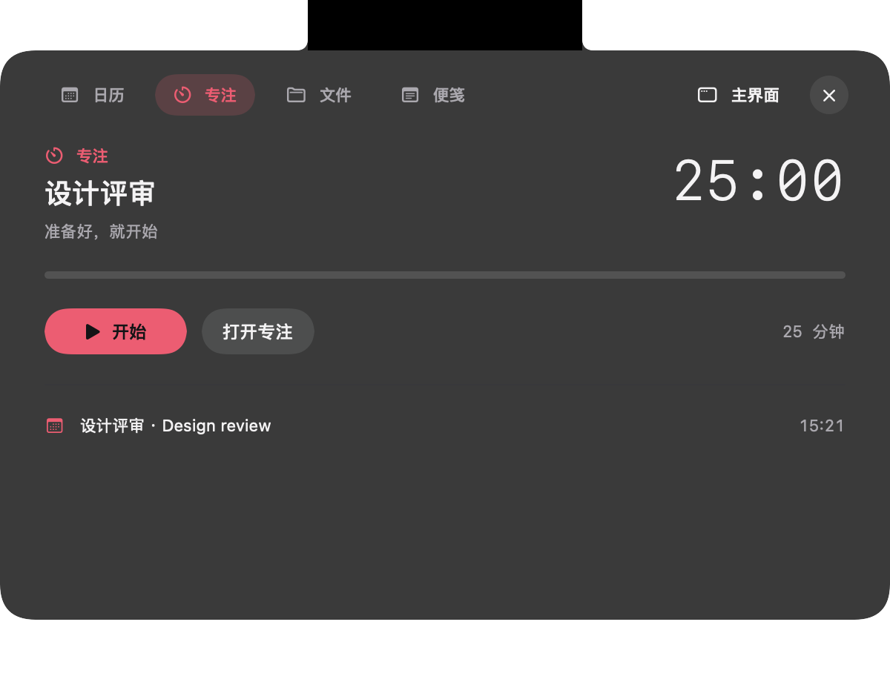
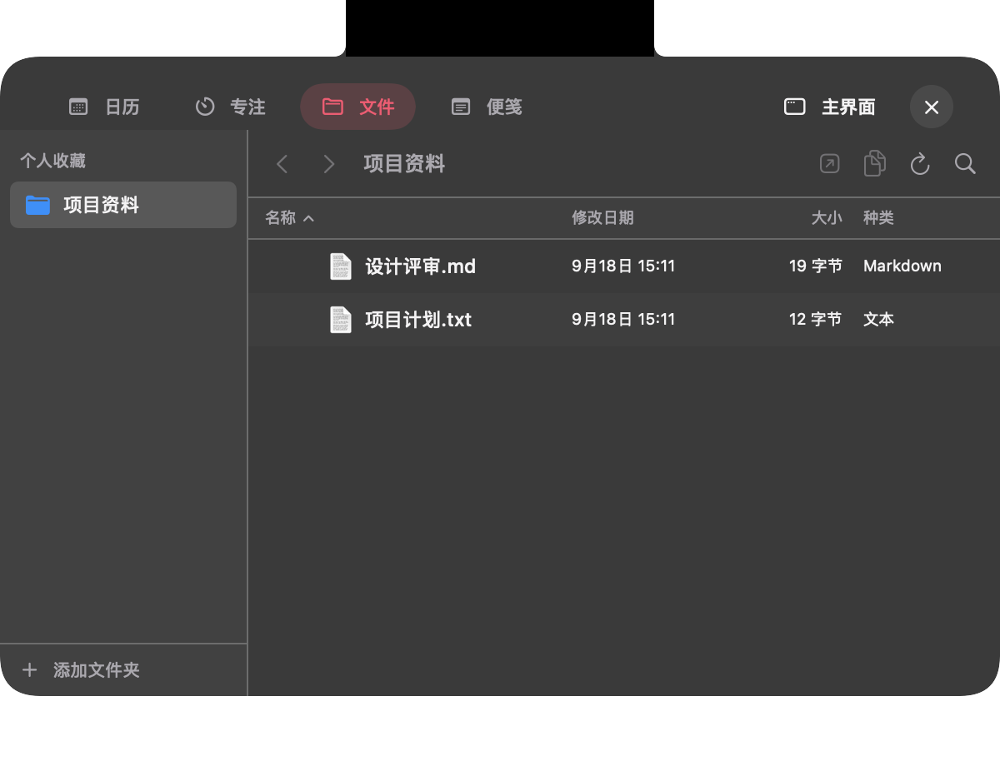
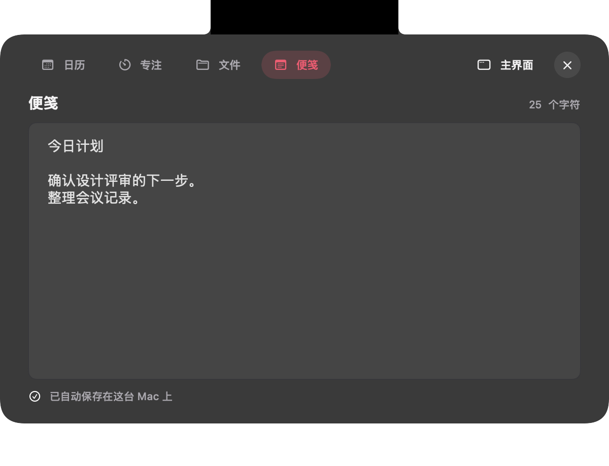
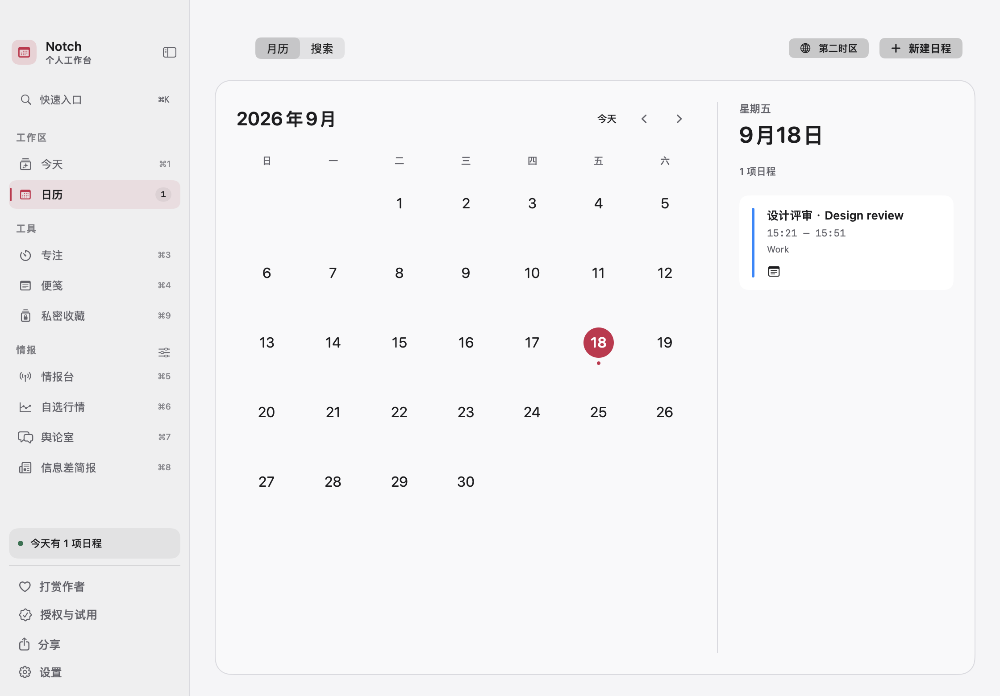
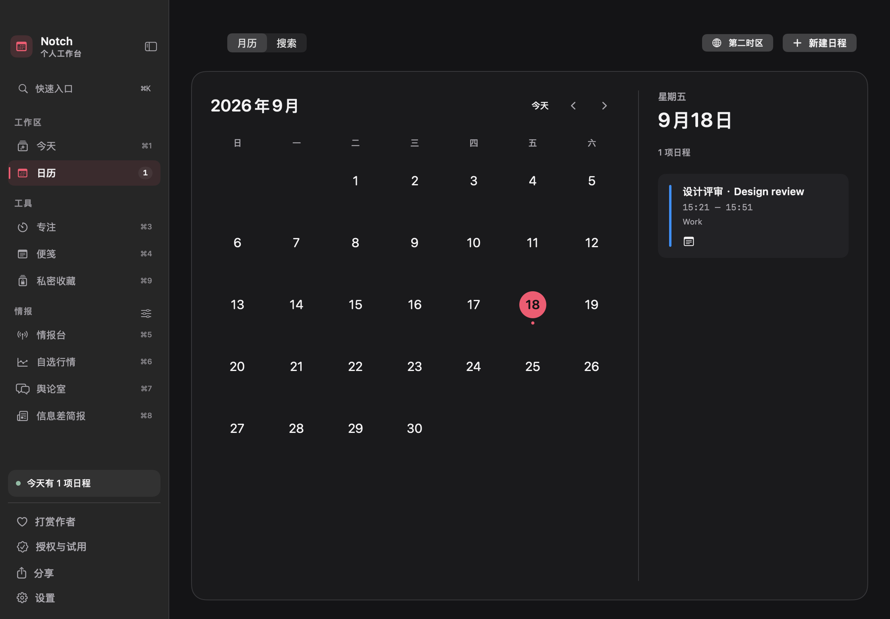

# Notch Calendar

从 Mac 刘海展开日历、专注、文件和便笺；完整工作台支持浅色、深色与可选毛玻璃材质。

[English](README.en.md) · [下载](https://github.com/GpsLypy/NotchCalendar/releases/latest) · [反馈问题](https://github.com/GpsLypy/NotchCalendar/issues)

### 刘海旁的独立状态岛

专注图标与倒计时、会议标题与进度分别出现在刘海两侧，中间留空，不再连成一整条黑色宽块。

| 专注计时 | 会议进行中 |
| --- | --- |
|  |  |

原生紧凑视图采用隔离演示数据，菜单栏与实体刘海为合成示意背景，非实拍。

## 从刘海展开

悬停或点击顶部入口，切换 **日历、专注、便笺**；在设置中启用文件浮窗后，还可从 **文件** 菜单浏览收藏目录。无刘海的外接显示器使用顶部居中入口。

| 日历 | 专注 |
| --- | --- |
|  |  |
| 文件（需启用） | 便笺 |
|  |  |

## 深浅色与毛玻璃

完整工作台可选浅色、深色或跟随系统，也可在设置中启用半透明毛玻璃材质。刘海面板始终保持深色。

| 浅色工作台 | 深色工作台 |
| --- | --- |
|  |  |

图片来自原生 SwiftUI 视图的离屏渲染，使用隔离演示日程、文件和笔记；不包含实体刘海或桌面背景，不能展示真实桌面上的折射效果。

## 1.6.19：更紧凑的打卡弹窗

- 弹窗高度随打卡事项数量变化，不再为单条提醒留下大块空白。「收起提醒」只隐藏弹窗，胶囊仍保留待办；「移除」清除对应打卡，操作与「完成」清楚区分。

## 1.6.18：打卡稳定性修复

- 修复 macOS 在后台线程发送跨日通知时可能导致 1.6.17 退出的问题；早晚打卡和会议唤醒提醒现在会在主线程处理通知。

## 1.6.17：早晚打卡提醒

- 刘海左侧新增打卡胶囊；默认早间 08:00–10:00、晚间 18:00–20:00，在应用启动、电脑唤醒或持续运行进入时段时弹出。待办会保留到完成或手动移除，关闭弹窗后仍可点击胶囊查看。
- 在「设置 → 通用 → 打卡提醒」调整早晚时间；已安装应用默认请求登录时启动，可在设置中关闭，macOS 可能要求在登录项中批准。

## 1.6.15：专注控制与胶囊交互

- 运行或暂停专注时，可在刘海专注面板点击「取消」结束计时并收起专注胶囊；取消不计入已完成专注。
- 专注和会议双侧胶囊显示期间，点击胶囊才展开面板；空闲时仍按原有悬停或点击设置操作。

## 1.6.14：刘海状态岛与工作台

- 紧凑状态分别显示在刘海两侧；工作台可选择浅色、深色和毛玻璃材质。
- 更新日历、专注、文件及工作台交互，补充离线诗笺与私密收藏入口。

## 1.6.13：刘海展开与窗口适配

- 日历数据在刘海展开过程中刷新时，展开窗口不再突然改变高度；中途收起或重新展开时旧动画不会继续拉动窗口。
- 矮屏下可以滚动查看展开内容，窄屏下可横向滚动，顶部功能入口保持可用。
- 以下购买、试用与数据保护功能沿用 1.6.12：

- 免费试用期间正常使用；仅在最后 48 小时显示一次可关闭的到期提醒，侧栏可查看截止时间。
- ¥9.9 一次买断包含未来所有版本更新，无订阅；付款码须主动展开，付款后需发送凭证与安装标识人工领码，不会自动激活。
- 到期后仍可只读查看本地便笺、会议笔记、专注记录和文件位置并导出普通备份；私密收藏单独通过系统认证并导出未加密文件。
- 工作台侧栏可隐藏/恢复；打赏不等于买断或激活。

## 个人工作台

- **今日诗笺**：14 条离线古典诗句，每日轮换，可换一句、收藏和收起。
- **私密收藏**：系统身份验证后访问本机加密的网站收藏，支持搜索、置顶和编辑；离开页面、切换应用或窗口、锁屏和休眠时自动锁定。
- **按需上手**：从设置主动打开上手引导，选择查看日历、开始专注或收藏诗句中的一个目标。
- **按需显示资讯**：在侧栏或设置隐藏不用的资讯模块，快捷键和搜索入口同步调整。
- **领码更方便**：复制所需资料，或打开预填邮件后附上付款凭证并自行发送；已激活用户也能自愿打赏。

私密收藏不包含在普通 JSON 备份内，到期后仍需通过系统身份验证才能单独导出；导出的文件未加密，应妥善保管。本机加密收藏仍需保留钥匙串密钥。打开网站仍使用默认浏览器，浏览器可能记录历史。详见 [本版发行说明](RELEASE_NOTES.md)。

## 下载与使用

要求 macOS 15 或更新版本，支持 Apple 芯片与 Intel Mac。下载 DMG 后将应用拖入「应用程序」，打开应用开始使用。

采用闭源发行。新用户首次启动自动开始 **7 天免费试用**，不先展示收款二维码；试用结束后需要永久授权码，但仍可只读查看并导出本地数据。一次支付 **¥9.9**，永久使用，**包含未来所有版本更新，无订阅**。已激活用户不再自动弹出收款窗口。

历史 MIT 版本不受新的付费规则追溯影响。请以所下载版本的发行说明为准。

## 支持作者与永久激活

1. 在工作台侧栏「授权与试用」（或设置中的同名入口）了解买断及领码步骤，主动展开付款码后扫码支付 ¥9.9。
2. 复制窗口中的安装标识，将安装标识和付款凭证发送给作者。
3. 作者收到完整付款凭证和安装标识后通常 24 小时内回复授权码；将授权码粘贴到应用并激活，付款不会自动开通。

联系邮箱：**498988598@qq.com**；手机：**13191513539**。

收到完整付款凭证和安装标识后，通常 **24 小时内回复**。换机或重装可凭购买记录免费补发，不设年度次数限制，仅限本人使用。已付款但未收到或丢失授权码，请回复原邮件并提供凭证和当前安装标识，无需再次付款。

授权码在本机离线验证，绑定安装标识。换机或丢失钥匙串记录后，请联系作者补发。授权信息保存在 macOS 钥匙串中，不包含在普通设置备份内。

## 数据与权限

日历通过系统 EventKit 访问；便笺和专注记录保存在本机。日历、通知等权限按功能需要申请。公开资讯与更新检查需要网络；付款由微信处理，应用不会自动核实到账或读取支付账户。

本仓库只保存公开说明、必要图片与许可证说明。安装包通过 Releases 发布。
许可条款见 [LICENSE](LICENSE)，历史 MIT 声明见 [THIRD_PARTY_NOTICES.md](THIRD_PARTY_NOTICES.md)。
