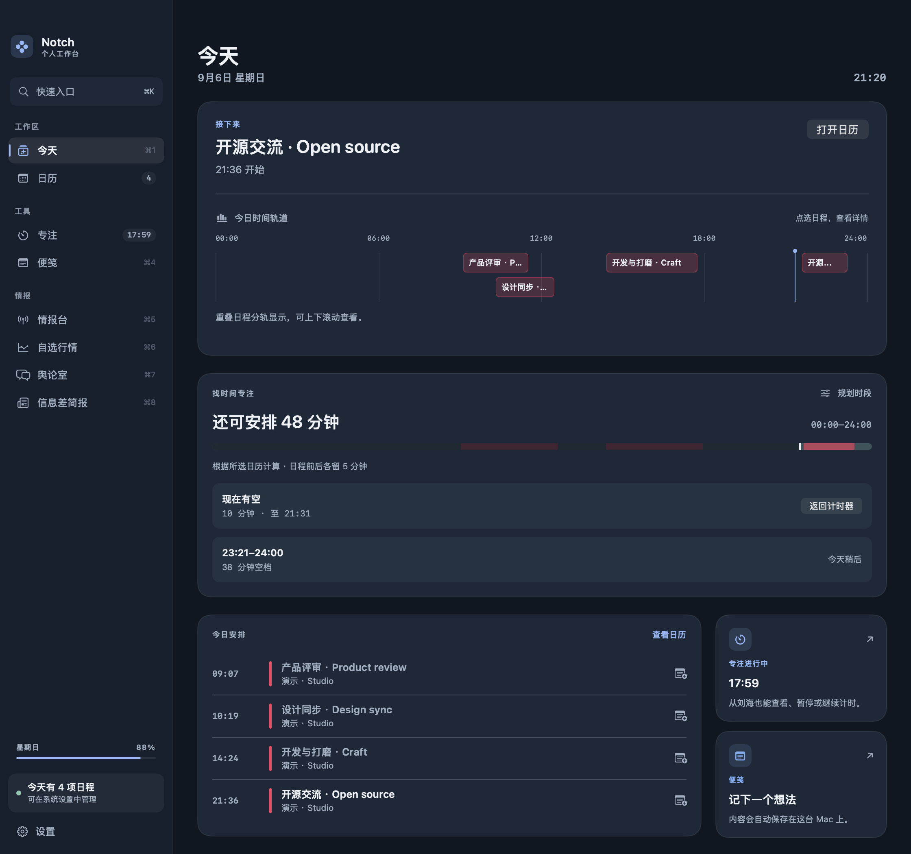
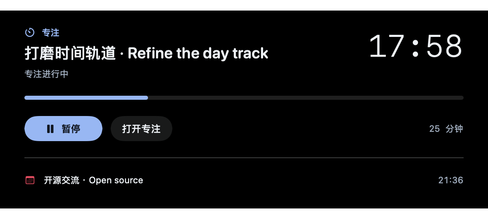

# 体验审视：把一天串起来

本轮基于 0.8.1 源码开发，改动纳入 0.9.0。发布构建与验证见[本版验证记录](VALIDATION_V0.9.0.md)。目标是让日程、专注、会议笔记成为连续的原生工作流，形成独立的开源产品体验。

## 审视结论

项目已有日历来源管理、会议提醒与入会、事件创建、专注历史、会议笔记、备份、快捷指令及资讯工具。当前更需要加强入口之间的联系：原刘海只能显示日历；桌面上正在运行的专注很难抬眼查看；八个目的地和当天事件缺少统一键盘入口；今日规划虽然能算出空档，却很难一眼分辨原始日程与重叠关系。

本轮保留已有功能及数据结构，集中改善这些每天都会遇到的路径。

## Alcove 给出的启示

2026-09-06 读取用户提供的 [Alcove 更新日志](https://tryalcove.com/changelog)及该页面公开加载的[日志数据](https://api.tryalcove.com/changelog)。接口标注更新至 June 2026，最新条目为 1.7.9（2026-06-30）。

| 官方日志中的能力或修正 | 对本项目的判断与落地 |
| --- | --- |
| 多个实时活动、Duo mode、无刘海胶囊 | 让日历与专注共享刘海入口，展开后可切换；紧凑状态有明确优先级 |
| 日历展开与日历来源选项 | 复用项目已实现的来源筛选，把当天日程映射为可检查的时间轨道 |
| 持续修正悬停、焦点、休眠及输入监听 | 保留停稳悬停和不主动抢焦点原则，增加原生键盘验证与减少动态效果支持 |
| 媒体播放、HUD、设备连接、锁屏组件 | 作为后续候选单独评估系统兼容性、权限与能源开销，本轮未实现或宣称这些能力 |

这里借鉴的是交互原则，不能据此宣称本项目已与 Alcove 全面功能对等。长期差异化方向是本地日程、专注记录和会议笔记的连续性。

## 视觉方向

桌面使用蓝灰层级：画布 `#101722`、侧栏 `#151F2D`、内容表面 `#1C2838`；主要文字 `#EDF2F7`、次要文字 `#9FAFC2`、专注控件 `#90B8F8`。日程保留珊瑚色，空档使用薄荷色。

标题使用少量圆角系统字体，正文保持标准系统字体，时间使用等宽数字。标志性交互是带当前时刻指针的时间轨道；其余界面保持安静。初次打开工作台进入今日，既有页面与快捷键继续保留。

## 新功能如何使用

### 今日时间轨道

- 范围跟随今日规划的起止时段，长度对应事件真实时长。
- 点选事件块查看完整标题、起止与来源，再打开对应会议笔记。
- 真正重叠的事件使用独立轨道，相接的事件复用轨道。超过四轨可在轨道区域滚动，不丢弃日程。
- 轨道展示原始日程，不叠加会议缓冲；下方空档规划继续计算缓冲。
- 全天日程保留在日程列表，不进入定时轨道。取消、拒绝、时长无效的事件不驱动实时活动或轨道。
- 无权限、无来源或全部隐藏时保留可操作提示，不能把数据缺失显示为「全天空闲」。

### 刘海专注

- 开始计时后，在刘海两侧或无刘海显示器的顶部入口查看剩余时间。暂停时保留活动并显示暂停标识。
- 展开刘海可在「日历」「专注」间切换，在专注页暂停、继续或打开桌面专注。
- 「在刘海旁显示我的专注计时」默认开启；只在已有未完成计时时显示，可在设置关闭。该配置纳入本地备份。
- 若用户开启实时会议显示，进行中的会议优先占用紧凑入口；专注计时仍继续，展开后可以切回。
- 完成后不再占用紧凑入口；若专注页已经展开，则保留完成状态，避免内容突然切换。
- 复用现有绝对结束时刻、暂停和历史存储；休眠经过的时间仍计入计时，完成记录沿用原来的去重规则。

### 快速入口

- 在工作台按 `⌘K` 或点击侧栏「快速入口」。
- 可按中英文名称找页面，按标题、日历名称或地点查找今日日程。
- `↑` / `↓` 选择，回车执行，Esc 关闭；没有匹配时提供搜索建议。
- 运行中的计时可搜索「暂停」，已暂停的计时可搜索「继续」。不会以另一段新计时替换未完成的会话。
- 找到事件后进入对应会议笔记；交接时再次确认该事件仍属于当前可见来源。
- 查询在本机完成，不会为了搜索主动联网。

## 验证

2026-09-06 最终源码验证：

- 完整测试 220 项，215 项通过，5 项为原有按需截图／联网检查而跳过，0 失败。本轮新增 13 项逻辑测试和 2 项原生界面测试。
- 原生交互检查实际创建临时窗口并发送键盘事件：⌘K 打开、中英文搜索、回车打开页面、方向键导航、暂停与继续、搜索事件后转入会议笔记及 Esc 关闭均通过。
- 渲染 17 张原生 SwiftUI 图：中英文、860/1120 点窗口、运行与暂停计时、两种紧凑显示、完整展开日历／专注、搜索空结果、密集重叠及全部隐藏来源。已目视检查关键画面并修正计时按钮对比度。
- 逻辑覆盖区间裁剪、相邻／重叠、重复身份、无效事件、30 个并发日程、23/25 小时夏令时日、双语多词检索、活动优先级所有布尔组合、暂停重启及完成一次。
- 最终 Release 构建通过，主程序、更新器及小组件均验证含 `arm64` 和 `x86_64`。独立本地预览包的嵌套签名、四个快捷指令元数据与 ZIP CRC 校验通过。
- 两种语言资源检查和 `git diff --check` 通过。
- 自动验证使用隔离偏好与合成日历，不修改真实日程。

重现本轮测试：

```sh
DEVELOPER_DIR=/Applications/Xcode.app/Contents/Developer \
NOTCH_DESK_INTERACTION=1 \
NOTCH_DESK_CAPTURE_PATH="$PWD/.build/desk-review" swift test
```

`NOTCH_DESK_INTERACTION` 会短暂显示测试窗口。省略上述两个开关时，新增的两个按需界面检查也会跳过，日常测试保持离线。

### 原生界面预览

以下为当前源码渲染，日程和任务标签均为演示数据。图像不表示读取了用户的真实日程，也不展示实体摄像头。






实体刘海的位置、跨显示器悬停、真实休眠与账户同步仍需实际设备验收；自动测试和界面渲染不能证明所有系统组合下都没有缺陷。

## 下一步质量门槛

1. 在刘海 MacBook 与普通显示器上验收悬停、点击、活动切换和跨屏唤醒。
2. 测量静置、专注运行和会议切换时的唤醒次数与 CPU 使用，再扩展活动种类。
3. 后续新增活动保持同一套选择规则、错误状态、键盘操作与本地优先的数据约束。
4. 面向正式 1.0 的分发仍需 Developer ID 签名、公证以及更新渠道验证。

## 开发阶段的本地预览包（历史记录）

构建目录：`dist/experience-preview-2026-09-06/`，内有完整应用与 `NotchCalendar-experience-preview.zip`。先退出正在运行的 Notch Calendar，再打开该目录中的应用。预览沿用应用标识、本机数据与 0.8.1 版本号，属于包含 Unreleased 改动的本地开发包。

采用 ad-hoc 本地签名，未进行 Developer ID 公证；没有替换 Applications 中的应用，也没有发布到线上更新渠道。

ZIP SHA-256：`b0e0ef4bb3421fb952c2dd612fc48bb658338c58fdc5443d2ebc04b78ca162a0`。
